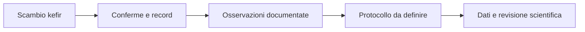
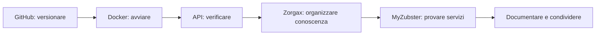

<p align="center">
  
</p>

<h1 align="center">N4K48</h1>

<p align="center">
  Open-source builder · AI-assisted product planning · MyZubster · Zorgax · Nicola Comics · Neon Plaza
</p>

<p align="center">
  <a href="https://dev.to/n4k48">DEV Community</a> ·
  <a href="https://github.com/nicolaususnicola-lgtm/myzubster">MyZubster</a> ·
  <a href="https://github.com/nicolaususnicola-lgtm/myzubster-mvp">N4K48 MVP</a> ·
  <a href="https://github.com/nicolaususnicola-lgtm/myzubster/blob/main/ROADMAP_N4K48_METAVERSE.md">Public roadmap</a>
</p>

## Servizi a Rimini — traslochi, autista e condivisione di competenze

I miei due servizi sono pubblicati sul **[Marketplace MyZubster](https://www.myzubster.com/marketplace)**. Sono munito di **patenti B, C, CE e CQC merci** e possiedo un **pickup con gancio traino**.

### Traslochi e trasporto ingombranti — pickup e autista disponibile

Piccoli traslochi e trasporto di mobili e oggetti ingombranti a Rimini e dintorni, compatibilmente con la capacità del mezzo. Sono disponibile anche come autista quando il cliente dispone già di un camion o di un mezzo adatto.

**Tariffa indicativa autista: 20 €/ora.** Utilizzo del mio pickup, carburante, pedaggi ed eventuale rimorchio sono da concordare prima del servizio.

[**Apri il Marketplace per richiedere il servizio traslochi**](https://www.myzubster.com/marketplace) — categoria `services`; cerca il titolo riportato sopra e premi **Richiedi**.

### Conoscenze pratiche da autista — patenti B, C, CE e CQC merci

Sessioni individuali per condividere la mia esperienza pratica: organizzazione di un trasloco, preparazione di un trasporto e aspetti pratici dell'attività di autista. Gli argomenti vengono concordati in base alle tue esigenze.

**Prezzo: 20 € per una sessione di un'ora.** A Rimini, su appuntamento. Il servizio non comprende corsi abilitanti, rilascio o rinnovo di patenti/CQC né lezioni pratiche di guida. Trasporto e incarichi come autista sono servizi separati.

[**Apri il Marketplace per richiedere una sessione di conoscenza**](https://www.myzubster.com/marketplace) — categoria `knowledge`; cerca il titolo riportato sopra e premi **Richiedi**.

I collegamenti aprono il Marketplace: al momento le schede non espongono un link diretto al singolo annuncio.

Per i traslochi indica partenza, destinazione, data, oggetti e disponibilità di un mezzo; per le sessioni indica l'argomento e la tua disponibilità.

**Contatto:** [nicolaususnicola@gmail.com](mailto:nicolaususnicola@gmail.com).

## Il mio percorso con Daniel Ioni — kefir, Docker e Zorgax

Il mio percorso collega servizi pratici, apprendimento tecnico e il pilot **Kefir & Knowledge / KF-006**.

**[Leggi il percorso completo e le visual](docs/percorso-daniel-kefir-zorgax.md)** · [MyZubster e mentorship](https://github.com/MyZubster-Ecosystem/myzubster/blob/main/docs/KNOWLEDGE-MENTORSHIP-PILOTS.md) · [Il mio fork di sviluppo](https://github.com/nicolaususnicola-lgtm/myzubster)

La documentazione ufficiale collega il mio pilot al repository **[Nicola di Daniel Ioni](https://github.com/DanielIoni-creator/Nicola)**. Al controllo del 18 settembre 2026 quel collegamento restituisce 404 anche dal browser: resta un riferimento documentato da ripristinare o aggiornare, non un'integrazione verificata.

### Kefir — dal passaggio reale alla ricerca


*Illustrazione dimostrativa del progetto originale MyZubster; non raffigura il nostro campione e non costituisce un risultato scientifico.*



Lo schema mostra il percorso previsto. La registrazione finale del passaggio e risultati scientifici non sono attestati qui. [Esplora KF-006](https://www.myzubster.com/knowledge-kf-006.html).

### Le competenze maturate nel progetto



Ho imparato a verificare lo stato dei container, provare le API del catalogo, riportare errori riproducibili e pubblicare servizi con descrizioni e prezzi chiari. Daniel ha contribuito al confronto e al coordinamento del percorso; l'assistenza AI ha supportato testi, codice e documentazione. Nel [diario del percorso](docs/percorso-daniel-kefir-zorgax.md) distinguo attività svolte, contributi e verifiche ancora necessarie.

## What I am building now

I am connecting the **N4K48 / Nicola Comics pilot** to the wider **MyZubster + Zorgax** ecosystem.

The current pilot exposes a small, read-only comics catalog through an API. Zorgax can request the gallery, inspect a comic, identify the NFT candidate and explain the next verification steps without performing minting, wallet operations, payments or catalog mutations.

The integration is intentionally evidence-first: a comic is never described as minted unless verifiable on-chain proof exists, and rights remain `TO_VERIFY` until they are actually verified.

## Start here

- **Explore the technical MVP:** [N4K48 Project Planner AI/Zorgax](https://github.com/nicolaususnicola-lgtm/myzubster-mvp#n4k48-project-planner-aizorgax).
- **Run the MVP locally:** [Docker quick start](https://github.com/nicolaususnicola-lgtm/myzubster-mvp#avvio-rapido-con-docker).
- **Follow the Metaverse roadmap:** [N4K48 roadmap](https://github.com/nicolaususnicola-lgtm/myzubster/blob/main/ROADMAP_N4K48_METAVERSE.md).
- **Explore the visual identity:** [N4K48 profile](https://github.com/nicolaususnicola-lgtm/myzubster-mvp/blob/main/docs/N4K48.md).
- **Follow the comics pilot:** [Nicola Comics roadmap](https://github.com/nicolaususnicola-lgtm/myzubster-mvp/blob/main/docs/n4k48-comics/ROADMAP.md).

## N4K48 × MyZubster — Nicola Comics

Three AI-assisted comic pages tell the journey from a software idea to development and the future vision of Neon Plaza:

1. **Dall'idea software al metaverso** — current NFT candidate.
2. **Il software prende forma**.
3. **Verso Neon Plaza**.

The first comic is currently `NFT_CANDIDATE` / `PROPOSED_FOR_REVIEW`. Rights are still `TO_VERIFY`; contract address, token ID and transaction hash remain empty until a real verified mint exists.

[**Read the comic pages**](https://github.com/nicolaususnicola-lgtm/myzubster-mvp/tree/main/docs/n4k48-comics) · [Pilot roadmap](https://github.com/nicolaususnicola-lgtm/myzubster-mvp/blob/main/docs/n4k48-comics/ROADMAP.md) · [Zorgax adapter documentation](https://github.com/nicolaususnicola-lgtm/myzubster-mvp/blob/main/docs/nicola-comics/ZORGAX.md)

## Nicola Comics × Zorgax adapter

The pilot currently supports:

- `GET /api/comics` — public catalog.
- `GET /api/comics/{comic_id}` — comic detail/card.
- `POST /api/zorgax/ask` — read-only Zorgax adapter.
- Actions: `gallery`, `detail`, `candidate`, `next_steps`.
- Configurable public base URL through `NICOLA_COMICS_BASE_URL`.
- Docker propagation of the base URL without hardcoding a local PC address.

The local happy path has been manually verified with the Docker API healthy: gallery, detail, candidate and next-steps responses work as expected. The configurable base URL was also verified through Docker using a test URL, producing absolute comic detail URLs correctly.

The current environment does **not** contain `pytest`, so the automated comics test suite has not been rerun in the latest validation session. Historical test results are documented separately; current claims are limited to what was actually rechecked.

## Current integration milestone

Coordination with the public MyZubster project is tracked in **MyZubster-Ecosystem/myzubster issue #1176**.

The target public end-to-end flow is:

```text
Zorgax request
   ↓
Nicola Comics gallery
   ↓
Comic detail/card + image
   ↓
NFT candidate
   ↓
Rights verification
   ↓
Verified on-chain data only when it really exists
```

The pilot must be hosted on a public HTTPS endpoint separately from the local PC. Authentication secrets, if required by the public integration, belong in the hosting environment and must never be committed to the repository.

## Verified progress

- ✅ Persistent N4K48 character profile
- ✅ JWT-based authentication and authenticated Neon Plaza join flow
- ✅ Existing Metaverse automated verification: 4 suites / 22 tests passed locally on September 3, 2026
- ✅ Public N4K48 documentation, profile and visual identity
- ✅ Nicola Comics catalog with three comic entries
- ✅ `n4k48-comic-001` selected as NFT candidate without claiming a mint
- ✅ Read-only Zorgax adapter implemented
- ✅ Local Docker happy path manually verified
- ✅ Configurable `NICOLA_COMICS_BASE_URL` implemented and verified through Docker
- ✅ Public integration coordination opened as issue #1176
- 🚧 Public HTTPS deployment of the Nicola Comics pilot
- 🚧 Public Zorgax → pilot end-to-end integration
- 🚧 Rights verification and eventual on-chain proof

## Featured projects

### [N4K48 Project Planner AI/Zorgax](https://github.com/nicolaususnicola-lgtm/myzubster-mvp#n4k48-project-planner-aizorgax)

An experimental AI-guided project planner for turning one objective into clear activities, detecting mistakes and documenting verifiable progress.

### [MyZubster development fork](https://github.com/nicolaususnicola-lgtm/myzubster)

The public development fork containing the persistent N4K48 profile, JWT authentication, authenticated Neon Plaza flow, automated tests and project roadmap.

### [MyZubster MVP / Nicola Comics pilot](https://github.com/nicolaususnicola-lgtm/myzubster-mvp)

The technical MVP now includes the read-only Nicola Comics API and Zorgax adapter alongside Docker, observation APIs, local AI experiments with Ollama, Qdrant and retrieval-augmented generation.

## Working principles

```text
OBSERVE → DOCUMENT → BUILD → TEST → VERIFY → PUBLISH
```

Visuals and storytelling explain the direction. Code, tests, commits and evidence demonstrate what has actually been completed.

---

The projects shown here are experimental and under development. Public documentation, visuals and local test results do not by themselves demonstrate production deployment, commercial adoption, payment, partnership, verified intellectual-property rights or on-chain minting. Those claims are made only when supporting evidence exists.
