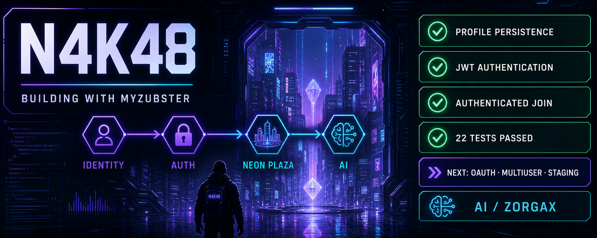



  

<h1 align="center">N4K48</h1>

  Building with MyZubster · AI/Zorgax · Neon Plaza

## Current progress

- ✅ Persistent N4K48 profile
- ✅ JWT authentication
- ✅ Authenticated Neon Plaza join
- ✅ 22 automated tests passed
- 🚧 Next: GitHub OAuth, multiuser testing and staging

## Projects

- [MyZubster](https://github.com/nicolaususnicola-lgtm/myzubster)
- [MyZubster MVP](https://github.com/nicolaususnicola-lgtm/myzubster-mvp)
- [Public N4K48 roadmap](https://github.com/nicolaususnicola-lgtm/myzubster/blob/main/ROADMAP_N4K48_METAVERSE.md)
