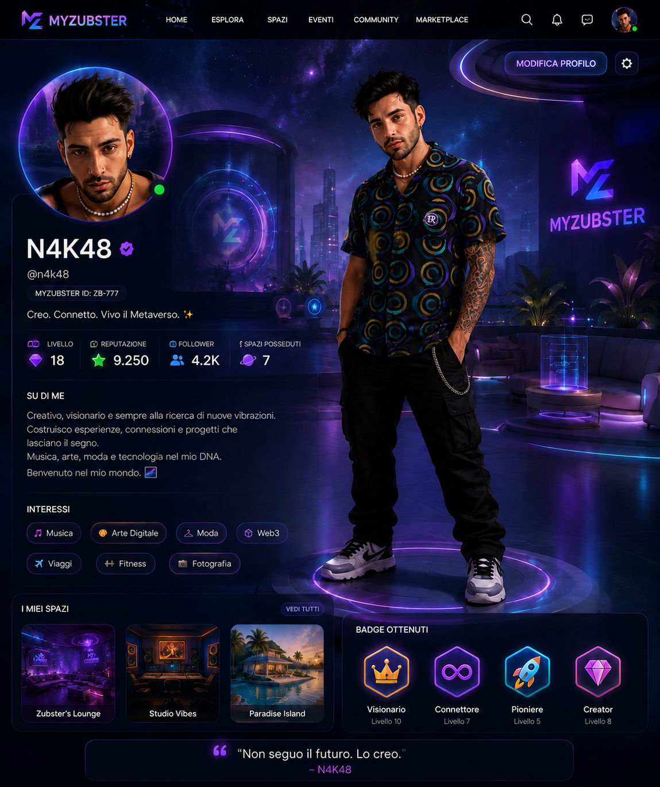

<p align="center">
  
</p>

<h1 align="center">N4K48</h1>

<p align="center">
  Building verifiable experiments across AI, APIs, digital identity, comics and MyZubster.
</p>

<p align="center">
  <a href="https://www.myzubster.com">MyZubster</a> ·
  <a href="https://github.com/nicolaususnicola-lgtm/myzubster-mvp">Nico Comics MVP</a> ·
  <a href="https://dev.to/n4k48">DEV Community</a>
</p>

## 👋 About me

I'm Nicola, building **N4K48**: an experimental path connecting software development, AI-assisted workflows, **MyZubster**, **Zorgax**, **Nico Comics** and the longer-term **Neon Plaza** vision.

My working principle is simple:

```text
OBSERVE → DOCUMENT → BUILD → TEST → VERIFY → PUBLISH
```

I try to keep public claims evidence-first: a feature is described as working when it has been tested, and blockchain/NFT claims are made only when verifiable on-chain evidence exists.

## 🚚 Competenze pratiche e servizi da autista

Sono Nicola, **N4K48**: affianco l'esperienza pratica nella guida di camion al percorso di apprendimento e contribuzione software con MyZubster.

- Guida di camion e disponibilità come autista.
- Patenti dichiarate: **B, C, CE e CQC merci**.
- Organizzazione di piccoli traslochi, preparazione dei trasporti e trasporto di ingombranti.
- Disponibilità di pickup con gancio traino.

Ho pubblicato nel [Marketplace MyZubster](https://www.myzubster.com/marketplace) i servizi **“Traslochi e trasporto ingombranti — pickup e autista disponibile”** e **“Conoscenze pratiche da autista — patenti B, C, CE e CQC merci”**. Le sessioni di conoscenze pratiche riguardano l'organizzazione e la preparazione dei trasporti; non sono corsi abilitanti o lezioni di guida. Disponibilità e condizioni dei servizi vanno concordate.

## 🤝 Il percorso con Daniel Ioni

Nel percorso MyZubster con **Daniel Ioni**, contribuisco attraverso prove pratiche del software, segnalazioni di errori e documentazione dei risultati, con supporto AI.

Il progetto [myzubster-mvp](https://github.com/nicolaususnicola-lgtm/myzubster-mvp) collega osservazioni collaborative, verifica di evidenze e il pilot Nico Comics. Le prove locali documentate del **18 settembre 2026** comprendevano un ambiente Docker con API, Open WebUI, Qdrant e Ollama, con i modelli Mistral e nomic-embed-text. La chat AI locale aveva risposto e il catalogo conteneva tre fumetti.

Questo descrive un percorso concreto di apprendimento e contribuzione: le competenze da autista e le attività software sono presentate separatamente, senza attribuire certificazioni informatiche o anni di esperienza non documentati. I risultati dei test locali sono distinti dai progressi della demo pubblica descritti qui sotto.

## 🚀 What I'm building now

### Nico Comics × MyZubster

The current public pilot turns three N4K48 comic boards into a small read-only catalog and API that can be queried by Zorgax-style clients.

**Public demo:** https://myzubster-mvp.onrender.com

Current capabilities:

- `GET /api/comics` — public comics catalog
- `GET /api/comics/{comic_id}` — comic detail
- `POST /api/zorgax/ask` — read-only adapter
- Actions: `gallery`, `detail`, `candidate`, `next_steps`
- Docker deployment and GitHub Actions verification
- Configurable `NICOLA_COMICS_BASE_URL`

The first board, `n4k48-comic-001`, is currently an **NFT candidate proposed for review**. Its rights status remains `TO_VERIFY`; no mint is claimed without contract address, token ID and transaction evidence.

### MyZubster real-world handover pilot

I also tested a real **hand-delivery workflow** in MyZubster using a kefir handover.

The verified application lifecycle reached:

```text
HAND_DELIVERY → HANDED_OVER → RECEIVED → RECORDED
```

The final application record reported `success: true`, `paymentRequired: false` and `onchainRecorded: false`.

That distinction matters: **RECORDED is a MyZubster digital record, not a blockchain claim.**

The test also surfaced a role-permission HTTP 403 during the recipient flow. Instead of bypassing it, we documented the error and continued only through the action enabled for the correct role.

## 🧪 Verified engineering progress

- ✅ Public Nico Comics HTTPS deployment
- ✅ Three-board N4K48 comics catalog
- ✅ Read-only Zorgax adapter
- ✅ `gallery`, `detail`, `candidate`, `next_steps` actions
- ✅ Docker verification
- ✅ GitHub Actions CI
- ✅ Public API smoke testing
- ✅ Evidence-first NFT candidate state
- ✅ Real MyZubster handover reaching `RECORDED`
- 🚧 Public MyZubster Zorgax → Nico Comics end-to-end bridge
- 🚧 Rights/provenance verification before any NFT mint claim
- 🚧 Broader Neon Plaza integration

## 🎨 Nico Comics

The first three AI-assisted N4K48 comic boards are:

1. **Dall'idea software al metaverso**
2. **Il software prende forma**
3. **Verso Neon Plaza**

[Explore the comic pilot](https://github.com/nicolaususnicola-lgtm/myzubster-mvp/tree/main/docs/n4k48-comics) ·
[Read the roadmap](https://github.com/nicolaususnicola-lgtm/myzubster-mvp/blob/main/docs/n4k48-comics/ROADMAP.md) ·
[Zorgax adapter docs](https://github.com/nicolaususnicola-lgtm/myzubster-mvp/blob/main/docs/nicola-comics/ZORGAX.md)

## 🛠 Tech & workflow

`GitHub` · `Docker` · `Python` · `Flask` · `REST APIs` · `GitHub Actions` · `Render` · `AI-assisted development`

I use AI as a development and documentation assistant while keeping tests, commits, API responses and deployment evidence as the source of truth.

## 📌 Featured work

### [Nico Comics / MyZubster MVP](https://github.com/nicolaususnicola-lgtm/myzubster-mvp)

Public API, Docker deployment, Zorgax adapter, automated verification and the Nico Comics pilot.

### [MyZubster development fork](https://github.com/nicolaususnicola-lgtm/myzubster)

Development work around the N4K48 profile, MyZubster experiments, authentication, Neon Plaza and project documentation.

## 🧠 MyZubster Conoscenze

Public knowledge cards documenting declared activities, practical experience and supporting evidence:

- [Prove Docker e chat AI del progetto myzubster-mvp](https://www.myzubster.com/knowledge-card?id=6abaaefb3a7460c4574a45fd) — Docker, local AI/RAG testing, Qdrant ingestion and linked GitHub evidence.
- [Apprendimento e collaborazione nel percorso MyZubster](https://www.myzubster.com/knowledge-card?id=6abaaf563a7460c4574a4623) — learning, collaboration and documented contributions in the MyZubster path.
- [Autista di camion e organizzazione dei trasporti](https://www.myzubster.com/knowledge-card?id=6abaae353a7460c4574a4597) — declared practical transport experience, kept separate from professional-document verification.

## 🌐 Follow the build

- [Public Nico Comics demo](https://myzubster-mvp.onrender.com)
- [DEV Community](https://dev.to/n4k48)
- [MyZubster](https://www.myzubster.com)

---

**N4K48 × MyZubster — Pilot 2026**

> Build it. Test it. Verify it. Then publish it.

The projects shown here are experimental and under development. Public documentation and application records do not by themselves demonstrate commercial adoption, verified intellectual-property rights, blockchain transactions or NFT minting.
