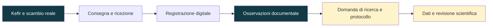
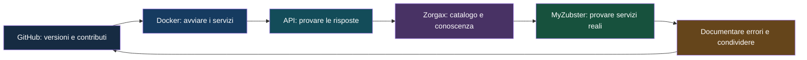

# N4K48 — percorso con Daniel: kefir, Docker, MyZubster e Zorgax

Aggiornamento: 18 settembre 2026.

## Collegamenti al lavoro di Daniel Ioni

La documentazione ufficiale [Knowledge Mentorship & Pilot Pathway](https://github.com/MyZubster-Ecosystem/myzubster/blob/main/docs/KNOWLEDGE-MENTORSHIP-PILOTS.md) identifica **[DanielIoni-creator/Nicola](https://github.com/DanielIoni-creator/Nicola)** come nodo del percorso di Nicola e KF-006. Il contenuto di quel repository non è stato verificabile durante questo aggiornamento.

- [Profili e template di Daniel](https://github.com/MyZubster-Ecosystem/myzubster/blob/main/examples/ecosystem-repositories/CHOOSE-YOUR-PROFILE.md)
- [Fermentation & Kefir](https://github.com/DanielIoni-creator/Myzubster-fermentation-kefir)
- [University & Research](https://github.com/DanielIoni-creator/myzubster-university-research)
- [Local Services](https://github.com/DanielIoni-creator/Myzubster-local-services)
- [Scheda pubblica KF-006](https://www.myzubster.com/knowledge-kf-006.html)
- [Il mio fork di sviluppo](https://github.com/nicolaususnicola-lgtm/myzubster)
- [Il mio MVP e catalogo Zorgax](https://github.com/nicolaususnicola-lgtm/myzubster-mvp)

## Visual — kefir, osservazione e ricerca

*Visual dimostrativa del progetto MyZubster, collegata alla fonte originale. Non è una fotografia del nostro campione né una prova sperimentale.*

Questo schema rappresenta il percorso di lavoro, non una sequenza già completata. Nel nostro test abbiamo affrontato accesso, identificazione del passaggio e conferme distinte di consegna e ricezione. La registrazione finale non è stata verificata in questa documentazione.

La parte scientifica resta un percorso da sviluppare: servono una domanda precisa, un protocollo, osservazioni datate, dati e revisione appropriata. Qui non presentiamo risultati microbiologici, misure o benefici sanitari. Il record digitale documenta un evento; non dimostra da solo la validità scientifica del contenuto.

## Visual — ciò che ho imparato nel percorso con Daniel

| Ambito | Attività svolta | Conoscenza pratica maturata |
|---|---|---|
| GitHub | Aggiornamento del progetto e pubblicazione di profilo, fumetti e documentazione | Collegare il racconto del progetto a file e versioni consultabili |
| Docker | Avvio dello stack locale dopo un errore di connessione al motore Docker | Distinguere il client dal motore e controllare lo stato dei container |
| API | Prove del catalogo fumetti e della richiesta gallery | Verificare una funzione tramite la risposta effettiva |
| Diagnosi | Individuazione del catalogo escluso dall'immagine Docker | Un container healthy non garantisce che ogni funzione sia disponibile |
| Zorgax | Utilizzo dell'adattatore catalogo con azioni esplicite | Distinguere assistenza AI, risposta strutturata e verifica umana |
| Marketplace | Test Traslochi, segnalazione di listingId nullo e valuta EUR mancante, successiva pubblicazione | Riprodurre un errore, comunicarlo e riprovare dopo la correzione |
| Conoscenza | Pubblicazione di sessioni individuali a 20 €/ora | Trasformare esperienza pratica in un'offerta descritta con chiarezza |
| Kefir | Percorso di consegna e conferme separate | Distinguere l'evento reale, la registrazione e l'eventuale verifica scientifica |

Daniel ha contribuito al percorso di confronto e coordinamento MyZubster. Io ho svolto prove dal mio ambiente, riportato gli errori e definito i miei servizi. L'assistente AI ha aiutato con testi, codice, documentazione e operazioni autorizzate. Le attività sopra non equivalgono a certificazioni delle competenze.

## Dalle competenze ai miei servizi

Sul [Marketplace](https://www.myzubster.com/marketplace) sono visibili:

- **Traslochi e trasporto ingombranti — pickup e autista disponibile:** autista a tariffa indicativa di 20 €/ora; uso del pickup e spese da concordare.
- **Conoscenze pratiche da autista — patenti B, C, CE e CQC merci:** sessioni individuali a 20 € per un'ora, a Rimini su appuntamento.

Cerca il titolo e premi **Richiedi**. I due annunci sono stati verificati nella pagina Marketplace; non è documentato qui un incasso o un servizio già completato.

## Prossimi passi

1. Provare la richiesta da un secondo account e documentarne l'esito.
2. Completare e verificare lo stato del passaggio kefir.
3. Collegare eventuali osservazioni KF-006 con provenienza e data.
4. Definire con i partecipanti il protocollo di ricerca e la revisione necessaria.
5. Condividere guide riproducibili su quanto effettivamente provato.

